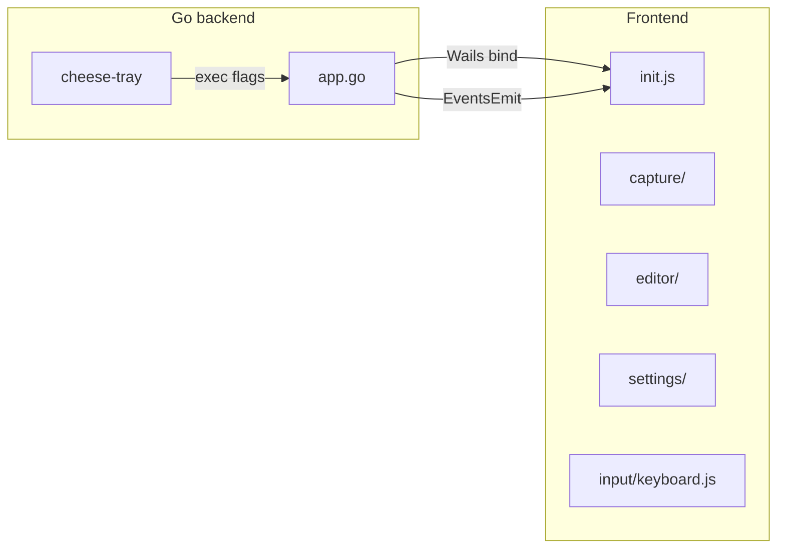

# AGENTS.md — cheese-wails

Guide for AI agents working in this repository.

## Project summary

**cheese-wails** (installed as `kiekje`) is a Wayland screenshot tool built with [Wails v2](https://wails.io). It provides:

- Region capture with a fullscreen overlay
- Window pick via `Ctrl + click` (Hyprland + Sway resolvers today)
- A canvas annotation editor (rect, arrow, pen, text)
- Settings for save dir, clipboard behavior, and Hyprland binds
- A tray sidecar (`cmd/cheese-tray`) and install script (`cheese.sh`)

Target desktop: **Hyprland first**, with partial support documented for Sway and roadmap specs for Plasma/GNOME.

## Repository layout

```
cheese-wails/
  main.go              # Wails app entry, window options, embed
  app.go               # Go backend: capture, state, binds, compositor APIs
  app_*_test.go        # Go unit tests
  cmd/cheese-tray/     # System tray sidecar
  frontend/
    src/               # Vanilla JS (ES modules, Vite)
    wailsjs/           # Generated Wails bindings — do not hand-edit
    dist/              # Build output (embedded by Go)
  docs/                # Specs — read before changing capture/window-pick
  build/               # Hyprland snippet template
  cheese.sh            # install / uninstall helper
  .agents/skills/      # Project-local agent skills (animations)
```

Git root is the parent `cheese/` monorepo; this app lives in `cheese-wails/`.

## Dev commands

```bash
# From cheese-wails/
wails dev                          # hot reload (Go + Vite)
wails build                        # production binary
cd frontend && npm run build       # frontend only

# Go tests
go test ./...

# Install locally
./cheese.sh install
./cheese.sh uninstall
```

After changing Go methods exposed to the frontend, regenerate bindings:

```bash
wails generate module
```

Commit updated files under `frontend/wailsjs/` when bindings change.

## Architecture



### Go ↔ JS boundary

- **Bindings**: methods on `App` in `app.go` are imported from `frontend/wailsjs/go/main/App.js`.
- **Events** (Go → JS via `runtime.EventsEmit`):
  - `cheese:capture` — start capture flow
  - `cheese:cancel-capture` — abort overlay
  - `cheese:choose-save-dir` — close menu during folder picker
- **Window chrome**: capture overlay uses `window.runtime.*` (`WindowFullscreen`, `WindowHide`, etc.) directly in `capture/overlay.js`.

Persisted settings live in `~/.config/cheese-wails/state.json` (see `AppState` in `app.go`).

### Frontend module map

Entry point: `frontend/src/main.js` → `init.js`.

| Module | Responsibility |
|--------|----------------|
| `state.js` | `createAppState()` — single mutable state object |
| `dom/template.js` | HTML shell + DOM refs |
| `capture/overlay.js` | Fullscreen selection, rulers, window preview |
| `capture/flow.js` | `startCapture`, post-capture routing |
| `editor/canvas.js` | Pointer handlers, tools, toolbar actions |
| `editor/annotations.js` | Draw, hit-test, selection frames |
| `editor/inline-text.js` | Inline text input overlay |
| `settings/menu.js` | Settings menu, toggles, bind recording UI |
| `settings/binds.js` | Pure bind parse/format/match helpers |
| `input/keyboard.js` | **Single** global keydown router |
| `ui/colors.js` | Unified toolbar + context color picker |
| `ui/tooltip.js` | Toolbar tooltips |
| `io/save.js` | Save/copy persistence via Go API |
| `utils/geometry.js` | Pointer math, selection rects |

**State rule**: prefer mutating `state` fields over new top-level globals. Pass `{ dom, state, actions }` into factory functions. Wire cross-module callbacks through `actions` in `init.js` when needed (see capture overlay ↔ editor).

**Style rule**: one CSS file (`frontend/src/style.css`). No React/Vue — keep the stack vanilla unless explicitly requested.

## Specs to read first

Before changing capture or window picking, read:

- [docs/capture-spec.md](docs/capture-spec.md) — overlay, post-capture rules, Esc/Ctrl behavior
- [docs/window-pick-spec.md](docs/window-pick-spec.md) — window geometry resolver contract
- [docs/feature-matrix.md](docs/feature-matrix.md) — platform support matrix
- [docs/distro-specs/](docs/distro-specs/) — compositor-specific notes

Window lookup implementations: `GetWindowGeometryAtPoint` in `app.go` (Hyprland IPC, Sway IPC).

## Conventions

### Go

- Keep capture/state mutations behind mutexes already in `App` (`captureMu`, `settingsMu`, etc.).
- New Wails-bound methods: add to `App`, run `wails generate module`, use from JS.
- Prefer small, testable pure helpers (see `app_second_instance_test.go` for CLI arg priority patterns).
- External tools invoked at runtime: `grim`, `slurp`, `wl-copy`, `hyprctl`, `swaymsg`, `zenity`/`kdialog` for folder picker.

### JavaScript

- ES modules only; Vite bundles for production.
- Pure logic → `utils/` or `settings/binds.js`; DOM wiring → domain module `init`/`create*` factory.
- Keyboard shortcuts: add to `input/keyboard.js`, not scattered listeners.
- Canvas drawing: keep render helpers in `editor/annotations.js`.

### UI / motion

Project skills in `.agents/skills/`:

- `emilkowal-animations` — easing, duration, reduced-motion, gesture patterns
- `animation-micro-interaction-pack` — hover, transitions, micro-interactions

Use existing CSS variables in `style.css` (`--ease-out`, `--duration-ui`, etc.) before introducing new timing values.

## Common tasks

| Task | Where to look |
|------|----------------|
| Change capture overlay UI | `capture/overlay.js`, `dom/template.js`, `style.css` |
| Change post-capture behavior | `capture/flow.js`, `app.go` (`CaptureRegionAt`, settings) |
| Add annotation tool | `editor/canvas.js`, `editor/annotations.js`, toolbar in `dom/template.js` |
| Add setting toggle | `dom/template.js`, `settings/menu.js`, `app.go` `UpdateSettings` |
| Add global shortcut | `app.go` bind writer + `settings/binds.js` + `input/keyboard.js` |
| Add compositor support | `app.go` resolver + new doc in `docs/distro-specs/` |

## Testing checklist

There is no frontend test suite. After UI changes, manually verify:

1. `C` or capture button → drag region → editor loads
2. `Ctrl + click` during capture → window geometry snap
3. `Esc` cancels overlay and restores window
4. Annotate → save / copy / undo
5. Settings toggles persist across restart
6. `--capture` second-instance IPC from Hyprland bind or tray

Run `go test ./...` for Go changes.

## Do not

- Hand-edit `frontend/wailsjs/**` (generated).
- Commit `frontend/dist/`, `node_modules/`, or the `cheese-wails` binary (gitignored).
- Add a frontend framework without an explicit request.
- Split capture/window lifecycle in ways that skip `FinishCapture()` or leave the window fullscreen/hidden.
- Remove `SingleInstanceLock` behavior — tray and Hyprland binds rely on second-instance args.

## Branch / commits

Active feature branch: `feature/cheese-screenshot-tool`. Match existing commit style: short imperative subject, body explaining *why*.

Only commit when the user asks.
